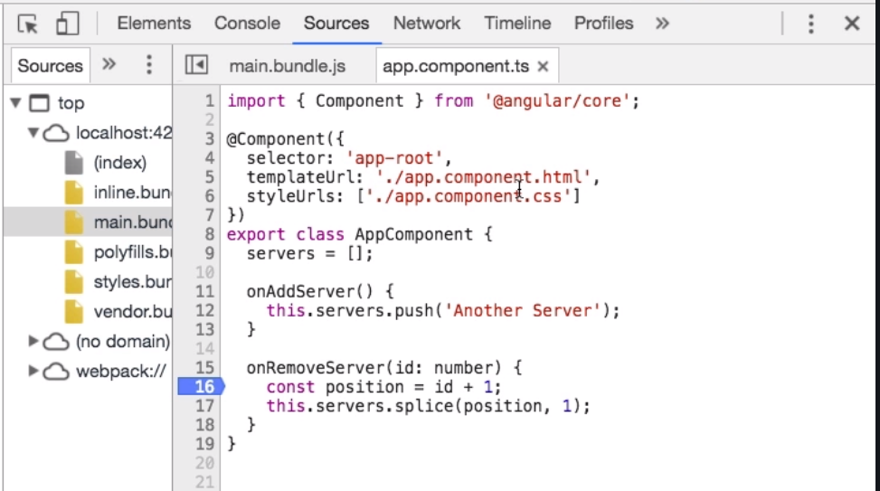
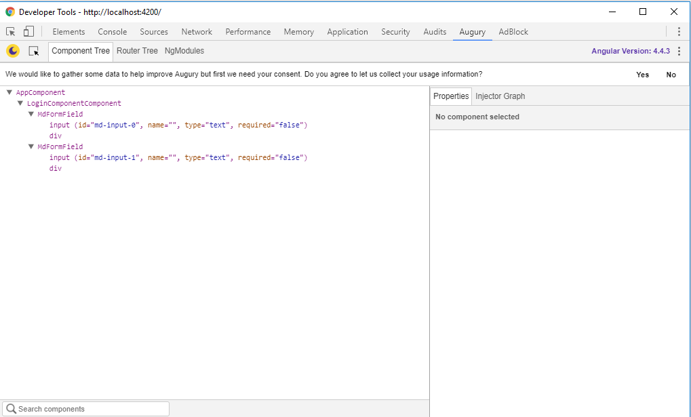
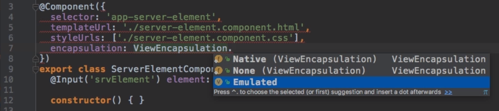

## Installing a new angular app
1. Install NodeJs

2. Install angular cli:
```
 npm install -g @anglular/cli
 ```
3. start new project:
```
 ng new my-new-app
 ```
4. include bootstrap:
```
 npm install --save bootstrap
 ```
5. import bootstrap in angular-cli.json file :
```
add   "../node_modules/bootstrap/dist/css/bootstrap.min.css"   to the styles
``` 

## How is angular linked together:
It all starts with the index.html file.
Inside there is a <app-root></app-root> component. This is the app.component.ts component. Its content will be (re)placed in the index.html file by angular.

## How is angular triggerd?
Look at the script bundels when you open the webpage, using F12. These are generated by angular cli.
They execute the main.ts file first! This will bootstrap the application by pointing to app.module.ts. Here we will import all stuff. ( bootstrap array = all components angular needs to know at the time of startup.

## Components
Single reusable piece of business logic.
Place components in folders which have the same name.
Naming convention: name.component.ts
Creating a component: A component is basicly a class => export class + classname (make it available to other parts of the app)
Add a decorater to the class to let angular know its a special class, a component => @Component (must be imported using : "import { Component } from '@angular/core' "
The decorator requires a typscript object for more information. This obj has a couple of fields:
* Selector => must be unique ( convention states it starts with app-...).There are multiple types of selectors:
	* Element selector: 'app-server' => <app-server></app-server>
	* Attribute selector: '[app-server]' => <div app-server></div>
	* Class selector: '.app-server' => <div class= "app-server"></div>
Normally for components we use the element style!

* Template(Url): points to the HTML that belongs with the component. The Url requires a RELATIVE path. All components must have a template! There are three options: 
	* Template: add a HTML string enclosed by ''.
    * Template: add more lines wrapping the html with backticks ´´
    * Use templateUrl to point at a html file.
* Styles: 
	* styleUrl => points to an external css style file. It is an array, so you can point to multiple files
    * styles => array of strings (use backticks for multiple lines) You can write inline css classes here

## App-module:
Module = bundle of functionality , like a domain. It has a @NgModule decorator with:
* declarations: all components we plan to use => also needs to be imported so Typescript knows it type.
* imports: add modules from outside this module, can be from angular of from yourself.
* providers:see later
* bootsrap: components angular needs to know to startup

Emmet: IntelliJ plugin to autocomplete html text.

## Data binding
#### Types
	1) String interpollation: {{data}}
    2) Property binding: [property] = "data"
#### String Interpollation:
You can insert any expression that returns/results in a String in between the {{}}. You can only use one line expressions or ternary expression. Hower if you enter a number inside, it will still work because the number can be converted to a string.

#### Property Binding:
To bind to a html property by placing the attribute of that property in between two squared brackets. (HTML properties can be set using their attributes ,for example: *disabled*, angular can bind directly to those properties!) There are also other properties we can bind to ( explenation follows). We need to write a Typscript expression between the ""! Example ` [property] = "this.aMethodThatResultsInABoolean()"` is a valid form of propertybinding since the expression evaluates to a boolean!

#### String interpollation vs Property binding

## Event binding
	(event)="expression"
    
   We bind to existing html events that exist on the element we are working on and bind this to our Typescript code.
   To pass info about the event to the method it calls we can pass the event `$event` to the method : `(click) = "onEventMethod)($event)"`  and we can use this in our component if the method looks like this: `onEventMethod(event : any){}`
## Two-way binding
	[(ngModel)]="data"
Two-way binding combines propertybinding => [] and eventbinding =>(). NgModel uses the data of the event to update our model.
    
## Directives
= instructions in the DOM ( the component selector is a directive WITH a template). There are also directives WITHOUT templates.

```Html
<p appTurnGreen > </p>
```
```Typescript
@Directive({
	selector='[appTurnGreen]'
})
export class TurnAppGreen{
	//....
}
```

Some built-in directives:
**1. *ngIf = "boolean expression"** (* means the directive can change the structure of the DOM) The element is added when true. When false it is not there, not just invisible!
The star before the directive indicates that it is a directive that can do structural changes to the DOM!
 ```html
	<p *ngIf = "serverWasCreated"; else noServer>Some text</p>
    <ng-template #noServer>
    <p> other text </p>
    </ng-template>
   ``` 

**2. Enhanced ngIf with else clause:**
```html
<p *ngIf="serverCreated(); else noServer">Server was created</p>
<ng-template #noServer>
	No server created
</ng-template>

``` 
#noServer is a marker in the DOM that we can show under certain condition.

**3. ngStyle (attribute directive without a *):****
```html
<p [ngStyle]={'background-color': getColor()}></p>
``` 
ngStyle is a directive but also a property  on the directive itself. It expects a JS object with the syle-property name and the value. We use [] to bind to the property of the directive!


**4. ngClass allows us to assign css classes dynamicly.**
```html
<p [ngClass]="{someCssClass: condition}">some text</p>
```
Like ngStyle we need to use the ngClass directive in combination with property bindin. Accepting a JS obj with a key-value inside. The key is the css class we want to apply. The value is the condition on which it needs to be added or not added to the element.

**5. ngFor:**
```html
<li *ngFor="let item of itemArray">{{item.name}}</li>
```
We create a variable `let item` that we can use in the html now.
If we want the use the index of the item inside the array:
```html
<li *ngFor="let item of itemArray; let i = index">{{item.name}}</li>
```
## Debuggin in Angular using sourcemaps
The javascript files in angular support sourcemaps which allow the browser to map the js run by the browser to our typescript files during development only. They get removed for production of course.
You can directly acces your typescript files under webpack/src/app...!



We can also debug using Augury, this is a plugin for google chrome. You can open it in your developer tools.



## Components and Databinding

### 1) Generating new componenents
```
ng generate component <component-name>
```

### 2) Passing data between components

**1. @Input()**

We can make our own properties on components so we can bind to them using property binding. To make a property on  the component and to expose it we must add a decorator to that property:

```typescript
@Input()
property: String;
```
```html
<p [property]="server"></p>
```
By adding the @Input() decorator we can expose our property for input means.
We can assign an alias to the property so we can use this alias in the outside world (because the naming makes more sense for the outside world but we want the current property name for inside the component)

This @Input is generally used when we want to pass data from a component to a child component.

```typescript
@Input('otherNameForProperty')
property: String;
```
**2. @Output()**

Typicly used to inform the parent component of a change inside the child component in the form of an event.

```typescript
import {Output} from '@angular/core'

@Output()
serverCreated = new EventEmitter<{serverName: String, serverStatus: String}>();

//sends the event
onAddServer(){
	this.serverCreated.emit({serverName: this.serverName, serverStatus: this.serverStatus});
}
```
```html
<p (serverCreated)="onEvent($event)"></p>
```
Here we can also assign an alias like we did with the @Input() decorator.

**3. Services***

When we want to pass data across components that are not closely linked, an alternative to a very long input-output chain could be to uses services. More explenation will follow later in this document.

**4. Local References**

Can be added to any HTML element and starts with a '#'. It holds a reference to the entire HTML element. We can use these references everywhere in the html template but NOT inside the typescript code !

```html
<input
type="text"
class="form-control"
#aReference
></input>

<button
class="btn btn-primary"
(click)="onClick(aReference)"
></button>
```
As you can see we can even pass the reference to a function inside the template. 
```typescript
onClick(element: HTMLInputElement){
	console.log(element.value)
	//the element contains te html element from our template
	//input fields have a property called value...
}
```

We get acces to the element when evaluating the method.

**5. @ViewChild()**

We can use this to get acces to the element BEFORE evaluation a method.

```typescript
@ViewChild('localReferenceOrComponentName')
serverContentInput: ElementRef;

aMethod(){
	console.log(this.serverContentInput.nativeElement.value);
	//nativeElement returns us the html element from out template which was of type input and contains a value property
}
```

We need to pass a local reference or the name of a component as a string to the decorator. These ways of accesing data are ment to be used in a read kind of way. It is not ment to modify the DOM using these localReferences!!
There are better ways for this like string interpolation, property binding or directives...

**6. Projecting contents into components using ngContent**

Used to inject html from outside the components template. The default behaviour of angular is to ignore everything you place between the opening en closing tag of your own components. Example:
```html
<my-component>everything we place here gets ignored by angular</my-component>
```

We can alter this behaviour by adding the ng-content DIRECTIVE inside of the template of the component where we want to input the html.

my-component.html
```html
<div>
	<div>
		<div>
		</div>
	</div>
</div>
<ng-content></ng-content>	//directive with and element-like selector
```

Angular will nog place everything it finds between the opening and closing tag of your component. It will project it into the component.

## Vieuw encapsulation

Angular modifies the default css behaviour of the browser. 
Angular automaticly adds a selector of its own to the attributes. For example _ngcontent-ejo-1 will be added to all elements in a component. Like this angular can enforce that css for a component will only be applied by that component.
We can override this behaviour by adding the encapsulation field to our component decorator:



1. Native: 		Uses the shadowDOM technology. Same behaviour as Emulated but only in browsers that support the shadowDOM.	
2. None: 		Normal css behaviour, no attributes are added to the elements by angular.
3. Emulated: 	Default in angular

## The component lifecycle

Angular supports a couple of lifecyclehooks which we can use to hook in and execute some code.

1. **ngOnChanges**: executed at the start when a component is created of when a property annotated with @Input is changed.
2. **ngOnInit**: executes when the component is initialized (object created => after constructor)
3. **ngDoCheck**: called whenever the change detection runs. On every check, for example after an event. There does not need to be a change to execute ngDoCheck
4. **ngAfterContentInit**: called when the content (passed via ng-content) is projected into the view
5. **ngAfterContentChecked**: called when the projected content has been checked
6. **ngAfterViewInit**: called after the components (and child views) has been initialized
7. **ngOnDestroy**: called right before the component is destroyed. Great place to do some cleanup


