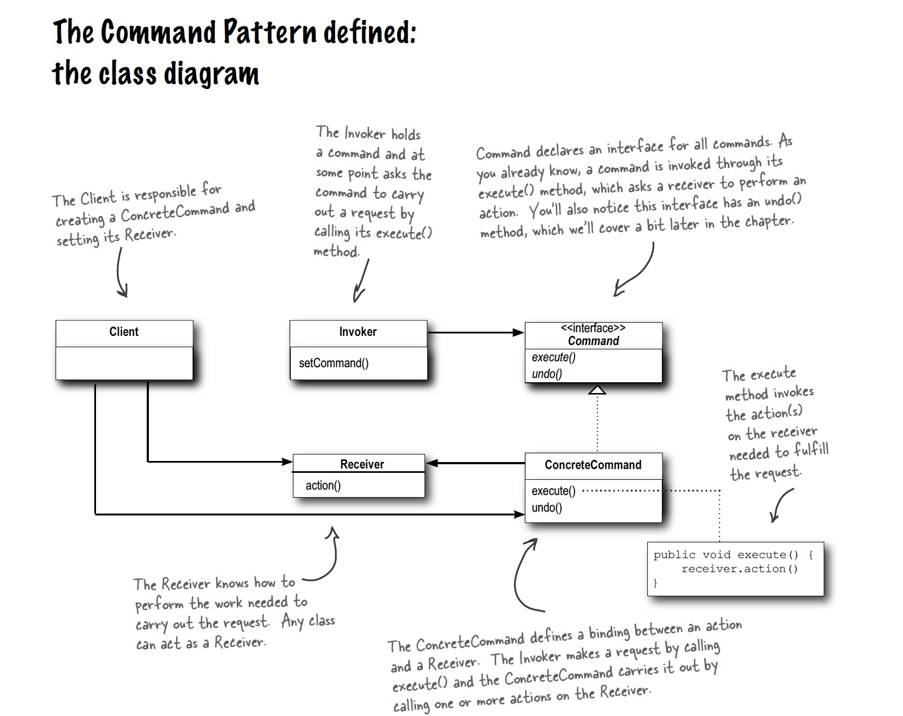

## Command Pattern

### Definition:

```
The Command Pattern encapsulates a request as an object, thereby letting you parameterize other objects with different requests, queue or log requests, and support undoable operations.
```

### Class Diagram:



### Macro Commands:

```java
public class MacroCommand implements Command {

	Command[] commands;

	public MacroCommand(Command[] commands) {
		this.commands = commands;
	}

	public void execute() {
		for (int i = 0; i < commands.length; i++) {
			commands[i].execute();
		}
	}
}
```

### Bullet Points:

- The Command Pattern decouples an object, making a request from the one that knows how to perform it.
- A Command object is at the center of this decoupling and encapsulates a receiver with an action (or set of actions).
- An invoker makes a request of a Command object by calling its execute() method, which
  invokes those actions on the receiver.
- Invokers can be parameterized with Commands, even dynamically at runtime.
- Commands may support undo by implementing an undo method that restores the object
  to its previous state before the execute() method was last called.
- Macro Commands are a simple extension of Command that allow multiple commands to
  be invoked. Likewise, Macro Commands can easily support undo().
- In practice, it is not uncommon for “smart” Command objects to implement the request themselves rather than delegating to a receiver.
- Commands may also be used to implement logging and transactional systems.

### Questions:

- If you store all your commands you could replay them. Is this how Event Driven Design works?
- When to chose to make an explicit command class and when to use a lamda (assuming the command contains only one method, otherwise the choise is fairly obvious).
- Encapsulate the receiver or handle the implementation of the command in the command itself?
