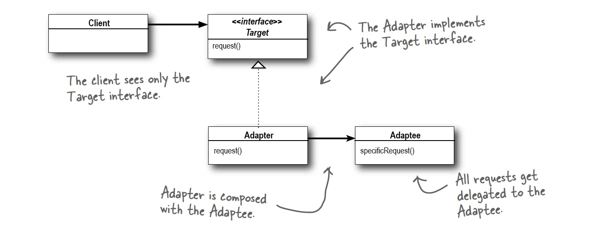

## Adapter Pattern
The adapter pattern fills the gap between the expected interface and the existing interface.
In java we use the object implementation of this pattern since the class implementation would require multiple inheritance which java does not allow.

### Example:

```java
public class TurkeyAdapter implements Duck {

	// Adapter patters uses composition!
	Turkey turkey;
	
	public TurkeyAdapter(Turkey turkey) {
		this.turkey = turkey;
	}
	
	//Implementes the method expected from our Duck interface and adapts it to the turkey
	@Override
	public void quack() {
		turkey.gobble();
	}
	
	
	//Implementes the method expected from our Duck interface and adapts it to the turkey	@Override
	public void fly() {
		for(int i=0; i < 5; i++) {
			turkey.fly();
		}
	}
}
```

### Definition:
```
The Adapter Pattern converts the interface of a class into another interface the clients expect. Adapter lets classes work together that couldn’t otherwise because of
incompatible interfaces.
```

### Class Diagram:


### Bullet Points:

* When you need to use an existing class and its interface is not the one you need, use an adapter.
* An adapter changes an interface into one a client expects.
* Implementing an adapter may require little work or a great deal of work depending on the size and complexity of the target interface.
* There are two forms of the Adapter Pattern: object and class adapters. Class adapters require multiple inheritance.
* An adapter wraps an object to change its interface, a decorator wraps an object to add new
behaviors and responsibilities, and a facade “wraps” a set of objects to simplify.


### Questions:
* Arent the adapter and command pattern very alike? Exept for their intent? Perhaps even their intent is very alike...
