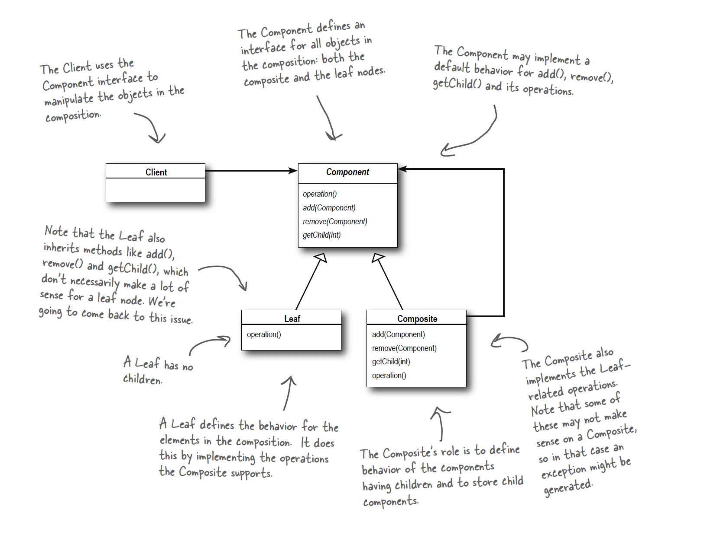

## Composite Pattern

### Definition:
```
The Composite Pattern allows you to compose objects into tree structures to represent 
part-whole hierarchies. Composite lets clients treat individual objects and compositions 
of objects uniformly.

```
* The Composite Pattern allows us to build structures of objects in the form of trees that contain both compositions of objects and individual objects as nodes.
* Using a composite structure, we can apply the same operations over both composites and individual objects. In other words, in most cases we can ignorethe differences between compositions of objects and individual objects.
* The Component is a general interface, containing default methods for both the leafs and composites. The leafs and composites override the methods that make sense for them and use the default implementation for those who dont! A typical default implementation would be to throw an UnsupportedOperationException. So if we were to call a method ment for a leaf on a composite we would get an exception back.


### Class Diagram:


### Example

Iterating over a composition:

```java

import java.util.*;

public class CompositeIterator implements Iterator {
	Stack stack = new Stack();
	
	public CompositeIterator(Iterator iterator) {
		stack.push(iterator);
	}
	
	public Object next() {
		if (hasNext()) {
			Iterator iterator = (Iterator) stack.peek();
			MenuComponent component = (MenuComponent) iterator.next();
				if (component instanceof Menu) {
					stack.push(component.createIterator());
				}
			return component;
		} else {
			return null;
		}
	}
	
	public boolean hasNext() {
		if (stack.empty()) {
			return false;
		} else {
			Iterator iterator = (Iterator) stack.peek();
			if (!iterator.hasNext()) {
				stack.pop();
				return hasNext();
			} else {
				return true;
			}
		}
	}
	
	public void remove() {
		throw new UnsupportedOperationException();
	}
}

```
NullIterator:

```java

public class NullIterator implements Iterator {
	public Object next() {
		return null;
	}
	
	public boolean hasNext() {
		return false;
	}
	
	public void remove() {
		throw new UnsupportedOperationException();
	}
}

```

### Bullet Points:

* The Composite Pattern provides a structure to hold both individual objects and composites.
* The Composite Pattern allows clients to treat composites and individual objects uniformly.
* A Component is any object in a Composite structure. Components may be other composites or leaf nodes.
* There are many design tradeoffs in implementing Composite. You need to balance transparency and safety with your needs.

### Vragen/opmerkingen:
* Revieuw the iterating over a composition part
 