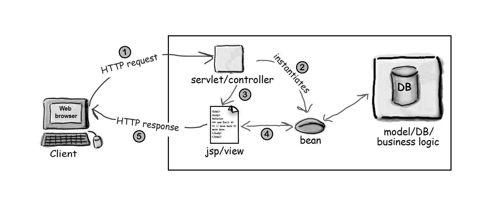

## Compound Pattern

### What is the compound pattern?

```
The compound pattern is a pattern of design patterns working together to create a general purpose solution to a general or recurring problem. Not just any combination of patterns is therefore a compound pattern. It has to be some sort of generic solution.

```
## MVC pattern

The MVC pattern is an exellent example of a compound pattern. The MVC consists of a Model, a View and a Controller.
The patterns used here are:
* Observer: the view is an observer of the model
* Strategy: the view has a strategy of controllers (controllers can easely be interchanged)
* Composite: the view is an example of the composite pattern. The composites are general containers containing the leaf components.
* Adapter: the adapter pattern is commenly used when reusing a controller and/or view with a new model.
#### Definition:
```


```

Design priciples used:

#### Usage


### Class Diagram (web mvc => model2):



### Example

An example of the usage of a compound pattern would be the MVC pattern.

```java

```

### Bullet Points:

### Vragen/opmerkingen:

* Servlets en jsp's: hoe verhouden deze concepten zich tot ons huidig web development? Servlet == rest-controller, 
