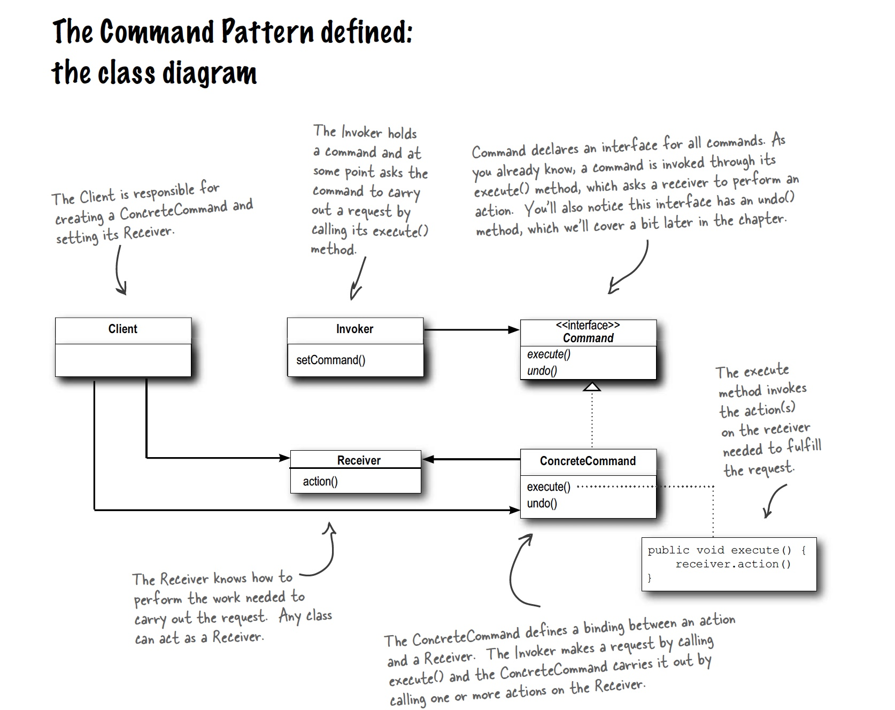
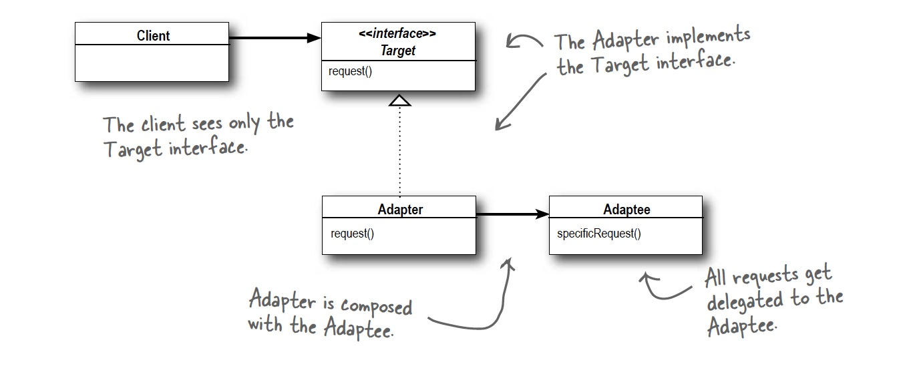

# Design Patterns

- [Factory Pattern](#Factory)
	* [Static Factory](#StaticFactory)
	* [Simple Factory](#SimpleFactory)
	* [Abstract Factory](#AbstractFactory)
- [Strategy Pattern](#StrategyPattern)
- [Decorator Pattern](#DecoratorPattern)

## Factory Pattern

### Static Factory

Create a static method within a class that is responsible of creating new instances of that class. We can use such methods to validate info before we make an actual object for example. To make sure this validation is performed it is typpical to make the classes' constructor private.


```java

public class Person(){

    private String firstName;
    private String lastName;

	//Private constructor
	private Person(String firstName, String lastName){

    	this.firstName = firstName;
        this.lastName = lastName;
	}


    //Factory method
    public static Person createPerson(String firstName, String lastName){

    	if(isValid(firstName,lastName)){
        	return new Person(firstName,lastName);
        }
        throw new ValidationException("invalid name");
    }
}
```

### Simple Factory

Create a factory class with the purpose of creating new objects.

```java

public class PersonFactory{

	public Person createPerson(String firstName, String lastName){
    	return new Person(firstName, lastName);
    }
}
```

```java

public class TestClass{

	private PersonFactory personFactory;

    public static void main(String ... args[]){

    	personFactory = new PersonFactory();
        Person testPerson = personFactory.createPerson("aFirstName","aLastName");
    }
}
```

## Strategy Pattern

#### *Category:*

Behavioural pattern

#### *Summary:*

The Strategy pattern provides a way to define a family of algorithms, encapsulate each one as an object, and make them interchangeable. This way we can decide the wanted algorithm/behaviour at runtime.

#### *Head First Defenition:*
```
The strategey pattern identifies the aspects of your application  that vary and seperates them form what stays the same.
```
#### *Gang of four Definition:*

```
The strategey pattern defines a set of encapsulated algorithms that  can be swapped to carry out a specific behaviour
```

 Stategy pattern is basesd on two OO design principles:
 ```
 1. Program to an interface, not an implementation.
 2. Favour composition over inheritance.
 ```

A simple design rule of strategy pattern is: 
```
Seperate what stays the same from what differs. The behaviour that differs can be extracted into an interface. All different types can then implement that interface and decide over their own behaviour.
```

#### *Typical usage:* 

The strategy pattern is mostly used when classes differ only in a certain behaviour and there are many possible versions of that behaviour. Typpicly we'll want to decide the implementation of that algorithm/behavior at run time. Saving files in different formats, choosing compression algorithms or sorting algorithms are typpical examples of day-to-day usage of the strategy pattern.

#### *Implementation:*

To implement the strategy pattern we first need to identify the varying behavior and extract it to an interface. Then we use compositon to encapsulate that behavior in our originall class. At runtime we we can add the correct implementation of the interface to choose the correct algortihm/behaviour we use.


Source: https://dzone.com/refcardz/design-patterns

#### *Example:*


An example of an interface that decides the behaviour of a certain hand (in the game of rock-paper-scissors). 


```java

public interface InterfaceHand{

public boolean winsFrom(HandEnum hand);

public boolean loosesFrom(HandEnum hand);

}


```

Each kind of hand (rock, paper or scissors) will implement the interface above and implement its methods on its own way. Each object will decide its own behaviour! Example:

```java

public class Rock implements Interfacehand{

	@Override

	public boolean winsFrom(HandEnum hand){

		if(hand == HandEnum.SCISSORS){
			return true;
		}
		return false;
	}

	@Override
	public boolean loosesFrom(HandEnum hand){

		if(hand == HandEnum.PAPER){
			return true;
		}
		return false;
	}
}

```

In the example above we see that the Rock class defines its own winsFrom() and loosesFrom() behaviour. We can make sure the class has that certain behaviour by letting it implement the InterfaceHand interface. The player class will encapsulate this behaviour.

```java

public class Player{

	//encapsulated strategy
	private InterfaceHand hand;

	//setter to set the strategy at runtime
	public void setHand(InterfaceHand currentHand){
		this.hand = currentHand;
	}

	//method lets the current strategy decide the behaviour that is being used
	public boolean playerWinsFrom(Interface otherPlayersHand){
		return this.hand.winsFrom(otherPlayersHand);
	}

	//method lets the current strategy decide the behaviour that is being used
	public boolean playerLoosesFrom(InterfaceHand otherPlayersHand){
		return this.hand.loosesFrom(otherPlayersHand);
	}
}
```
In the example we noticed that there were different kinds of behaviour that decided if the players hand would win/loose from another hand depending on the players hand. Instead of making an entire desiciontree inside the Player class we extracted the winsFrom/loosesFrom behaviour to an interface `InterfaceHand`. We made three strategies implementing that interface: `Rock`, `Paper` and `Scissors`. Each will determin when they win/loose form another hand. We encapsulated the behaaviour inside the `Player` class, added a setter to set the players hand at runtime and added two methods that will invoke the strategies winsFrom() and loosesFrom() methods.


## Decorator Pattern


The decorator pattern is a structural pattern. It has two different ways of using it:


1. The first way of using the decorator patters is to add functionality to an existing object without altering its structure. The already existing object will be wrapped by a new class, adding the new functionallity. 

2. A second way of using the decorator pattern is by wrapping an object into different layers where each layer adds for example a piece of a price or description. This follows the same logic as the builder pattern.


#### Example of case 1:

Note that using the interface here is a usage of the strategy pattern...

```java
public interface Shape{

	public void draw();
}

```

```java

public class Rectangle implements Shape{

	public void draw(){
		sout("Shape: Rectangle");
	}
}

```

```java

public class ShapeDecorator implements Shape{

	private Shape shapeToDecorate;

	public ShapeDecorator(Shape shape){
		this.shapeToDecorate = shape;
	}

	public void draw(){

		shapeToDecorate.draw();
		sout("Extra decoration");
	}
}

```

The shapeDecorator will wrap itself around the shape object and store it in its instance field. It will then add functionallity to it's draw() function by calling the draw function of the shape and then adding its own functionallity.

#### Example of case 2:

In the second example we can have many different and independant layers and one base-layer. this will be the base that we will wrap in the other layers. 

Each layer class will implement the same interface, have a field to store an object of type of that interface (the previous layer that will be encapsulated). The current class's methods will call the methods of the previous object (stored in its field at the moment of creation) and add some of its own info.

##### The interface:

```java

public interface PricePackage{

	public int getPrice();
}
```

##### The base layer:

```java

public class BasePackage implements PricePackage{

	// Implement the method
	public int getPrice(){
		return 1000;
	}
}
```

Note that the class above is the base layer and thus has no field to store a previous pricePackage! This class will be wrapped by other layers but it wont wrap anything itself.

##### An example of another layer:

```java

public class WrapperLayer(){

	// Field to hold the previous layers
	private PricePackage previousPackage;

	//Constructor stores the previous layer into its field
	public WrapperLayer(PrivePackage pack){
		this.previousPackage = pack;
	}

	//Implement the method by adding info to the previous layer(s)
	public int getPrice(){
		return previousPackage.getPrince() + 50;
	}
}

```

##### Using the example above:

```java

public class TestClass{

	public static void Main(String ... args[]){

		PricePackage package = new WrapperLayer(new BasePackage());

		// Will return 1050
		package.getPrice();
	}
}
```

## Command Pattern

### Defenition:
```
The Command Pattern encapsulates a request as an
object, thereby letting you parameterize other objects
with different requests, queue or log requests, and support
undoable operations.
```

### Class Diagram:



### Macro Commands:

```java

public class MacroCommand implements Command {

	Command[] commands;

	public MacroCommand(Command[] commands) {
		this.commands = commands;
	}

	public void execute() {
		for (int i = 0; i < commands.length; i++) {
			commands[i].execute();
		}
	}
}
```

### Bullet Points:
* The Command Pattern decouples an object, making a request from the one that knows how to perform it.
* A Command object is at the center of this decoupling and encapsulates a receiver with an action (or set of actions).
* An invoker makes a request of a Command object by calling its execute() method, which
invokes those actions on the receiver.
* Invokers can be parameterized with Commands, even dynamically at runtime.
* Commands may support undo by implementing an undo method that restores the object
to its previous state before the execute() method was last called.
*  Macro Commands are a simple extension of Command that allow multiple commands to
be invoked. Likewise, Macro Commands can easily support undo().
* In practice, it is not uncommon for “smart” Command objects to implement the request themselves rather than delegating to a receiver.
* Commands may also be used to implement logging and transactional systems.

### Questions:
* If you store all your commands you could replay them. Is this how Event Driven Design works?
* When to chose to make an explicit command class and when to use a lamda (assuming the command contains only one method, otherwise the choise is fairly obvious).
* Encapsulate the receiver or handle the implementation of the command in the command itself?

## Adapter Pattern
The adapter pattern fills the gap between the expected interface and the existing interface.
In java we use the object implementation of this pattern since the class implementation would require multiple inheritance which java does not allow.

### Example:

```java
public class TurkeyAdapter implements Duck {

	// Adapter patters uses composition!
	Turkey turkey;
	
	public TurkeyAdapter(Turkey turkey) {
		this.turkey = turkey;
	}
	
	//Implementes the method expected from our Duck interface and adapts it to the turkey
	@Override
	public void quack() {
		turkey.gobble();
	}
	
	
	//Implementes the method expected from our Duck interface and adapts it to the turkey	@Override
	public void fly() {
		for(int i=0; i < 5; i++) {
			turkey.fly();
		}
	}
}
```

### Defenition:
```
The Adapter Pattern converts the interface of a class into another interface the clients expect. Adapter lets classes work together that couldn’t otherwise because of
incompatible interfaces.
```

### Class Diagram:


### Bullet Points:

### Questions:
* Arent the adapter and command pattern very alike? Exept for their intent? Perhaps even their intent is very alike...


## Facade Pattern

### Defenition:

### Class Diagram:

### Bullet Points:

### Questions:

## Template Pattern
Subclasses are responsible for the implementation of specific parts of the algorithm. The template pattern lets us offer hooks that a subclass may or may not implement to hook into the algorithm at any certain point. Real life examples of hooks are very present at Angular (think of the lifecycle hooks of a component like ngOnInit() etc... ).

 ```java
 public abstract class Template{
 	public int someAlgorithm(){
 		concreteMethod1();
 		concreteMethod2();
 		abstractMethod1();
 		abstractMethod2();
 		hook();
 	}
		public void concreteMethod1(){
			//some implementation
		}
		
 		public void concreteMethod2(){
			//some implementation
		}
		
		//abstract method to be implemented by the concrete subclass
 		public abstract void abstractMethod1();
 		
		//abstract method to be implemented by the concrete subclass
 		public abstract void abstractMethod2();
 		
 		hook(){
 		//empty
 		}
 

 }
 ```
 
### Design principles:
* Hollywood Principle:
 `Don't call us, we'll call you`
  