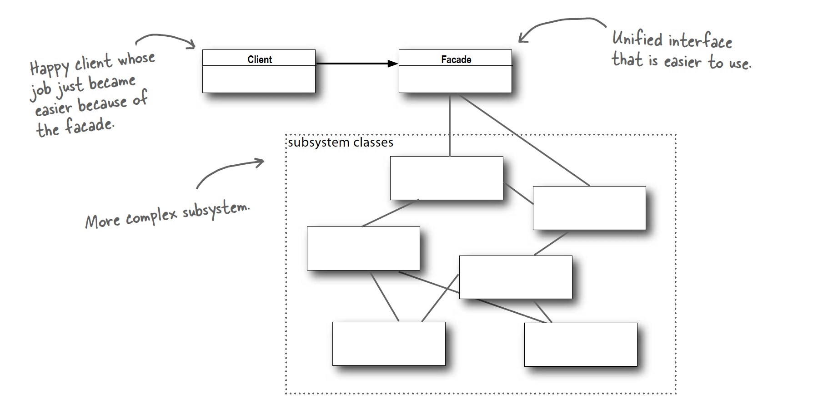

## Facade Pattern

### Definition:
```
The Facade Pattern provides a unified interface to a set of interfaces in a subsytem.
Facade defines a higherlevel interface that makes the subsystem easier to use.
```

### Example

### Class Diagram:


### Design Principle: Principle of least knowledge (Law of Demeter)
```
Talk only to your immediate friends.
```
When we have an object, whithin a method on that object we should only invoke methods of:
* the object itself
* objects passed into the method as parameters
* any object that gets created whitin the method
* any component/field of the object

Whithout the principle:

```java

public int getMilk(){
	Cow cow = farm.getCow();
	return cow.getMilk();
}

```

With the principle:

```java

public int getMilk(){
	return farm.getMilk();
}

```

### Bullet Points:

* When you need to simplify and unify a large interface or complex set of interfaces, use a
facade.
* A facade decouples a client from a complex subsystem.
* Implementing a facade requires that we compose the facade with its subsystem and use delegation to perform the work of the facade.
* You can implement more than one facade for a subsystem.
