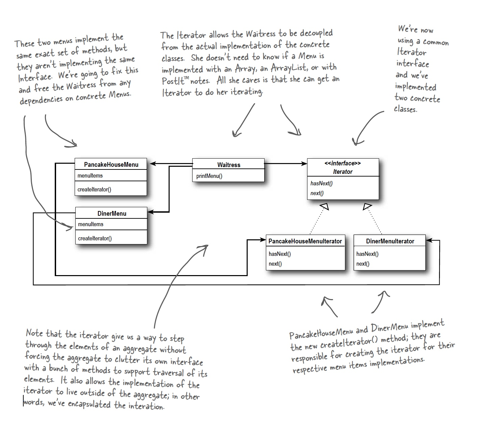

## Iterator Pattern

### Definition:
```
```

### Example

```java

public class DinerMenuIterator implements Iterator {
	MenuItem[] items;
	int position = 0;
	
	public DinerMenuIterator(MenuItem[] items) {
		this.items = items;
	}
	
	public Object next() {
		MenuItem menuItem = items[position];
		position = position + 1;
		return menuItem;
	}
	
	public boolean hasNext() {
		if (position >= items.length || items[position] == null) {
			return false;
		} else {
			return	 true;
		}						
	}
}

```

### Class Diagram:


### Design Principle: Principle of least knowledge (Law of Demeter)
```

```
### Bullet Points:

### Vragen/opmerkingen:
* Gebruik maken van generics om geen Object te moeten terug geven in de next() methode!!

TESTEN OF DIT WERKt VOOR VERSCHILLENDE TYPES! (p328)

```java

public interface Iterator<T>{

	boolean has next();

	T next();
}

```
