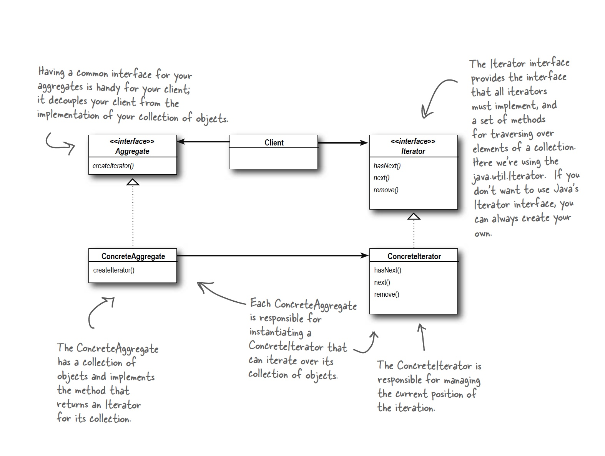

## Iterator Pattern

### Definition:
```
The Iterator Pattern provides a way to access the elements of an aggregate object sequentially 
without exposing its underlying representation.

```

### Example

```java

public class DinerMenuIterator implements Iterator {
	MenuItem[] items;
	int position = 0;
	
	public DinerMenuIterator(MenuItem[] items) {
		this.items = items;
	}
	
	public Object next() {
		MenuItem menuItem = items[position];
		position = position + 1;
		return menuItem;
	}
	
	public boolean hasNext() {
		if (position >= items.length || items[position] == null) {
			return false;
		} else {
			return	 true;
		}						
	}
}

```

### Class Diagram:


### Design Principle: Single Responsibility
```
A class should have only one reason to change.
```
* class is an area of potential change. More than one responsibility means more than one area of change.
* This principle guides us to keep each class to a single responsibility.

### Nested structures
This is where the [composite pattern](https://github.com/VanausloosThomas/PersonalDevelopment/blob/master/knowledge/DesignPatterns/CompositePattern.md) comes in!
### Bullet Points:

* An Iterator allows access to an aggregate’s elements without exposing its internal structure.
* An Iterator takes the job of iterating over an aggregate and encapsulates it in another object.
* When using an Iterator, we relieve the aggregate of the responsibility of supporting operations for traversing its data.
* An Iterator provides a common interface for traversing the
 items of an aggregate, allowing you to use polymorphism when writing code that makes use of the items of the aggregate.
* We should strive to assign only one responsibility to each class.

### Vragen/opmerkingen:
* Iterator helpt ons met loose-coupling tussen onze client en de implementatie van collecties! This makes the client easyer to extend!
* All of the java collection implementations have a build-in iterator!
* De for-each loop gebruikt achterliggend de iterator!

```java

for (Object o : collection){

}

```
* Gebruik maken van generics om geen Object te moeten terug geven in de next() methode!!

TESTEN OF DIT WERKt VOOR VERSCHILLENDE TYPES! (p328)

```java

public interface Iterator<T>{

	boolean has next();

	T next();
}

```
