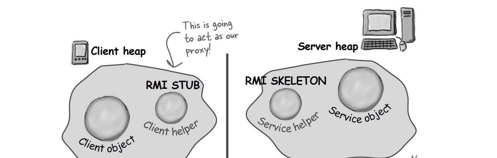

## Proxy Pattern

### What is a proxy?

```
A proxy is a stand in for a remote object. It acts just like the real object but behind the scenes it is communicating over the netwerk to talk to the real object.
The proxy acts as a local representation of the remote object (an object that lives inside another JVM). The proxy will accept all method calls the remote object does and foreward them to the real remote object.
```


### RMI
RMI, or remote method invocation. RMI gives us a way to find object in another heap and invoce methods on them. 

The clien helper is called a STUB and the service helper is called a SKELETON.
(Newer versions of Java dont require an explicit skeleton object, but it is there behind the scenes...)



The stub and sceleton take care of talking over the network.

### Definition:
```
The Proxy Pattern provides a surrogate or placeholder for another object to control access to it.

```

Design priciples used:

### Usage

There are some steps needed to use this pattern:
* Make an interface which both the proxy and the remote object need to implement. (sort of contract)
* The proxy talks to the remote object (or gets the info it needs) This can go through rmi or using REST (I think...)

Sometimes the proxy can be responsible for creating and destroying the remote object!!

### Class Diagram:


### Variations 

#### * Remote proxy: controls acces to a remote object

    Getting access to a remote object that lives on another JVM. When a method call gets invoced on the proxy (by a client), the call gets transferred over the wire (ethernet) to the real remote object. The result is then again transferred over the wire to the proxy and to the client.

#### * Virtual proxy: provides acces to a resource that is expensive to create

    The proxy is a placeholder for a resource that is expensive to create. When a method is invoced on the proxy it can either handle the call itself (with default valuess for example) or start the creation of the resource and delegate the method invocation to that resource from then on.
    An example could be a proxy that displays a placeholder immage while it is downloading the real immage.

#### * Protection proxy: controls access to a resource based on rights

### Example


```java

```

### Bullet Points:

### Vragen/opmerkingen:

* Implementatie van proxy met REST ipv RMI ? Waarom in dit hoofdstuk specifieke implementatie ipv het algemene idee van het pattern???
* Nieuwe thread nodig voor virtual proxy ??
