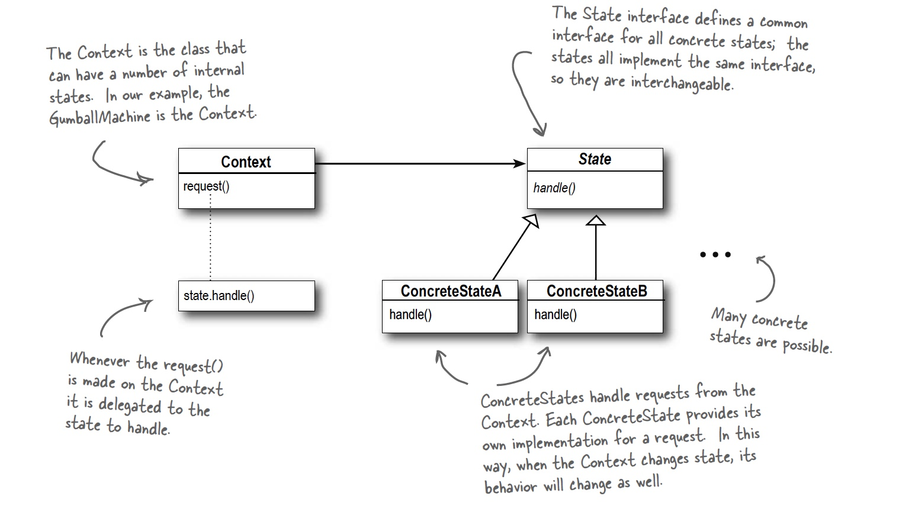

## State Pattern

### Definition:
```
The State Pattern allows an object to alter its behavior when its internal state changes.
The object will appear to change its class.

```

Design priciples used:

* Encapsulate what varies (the implementation of each method varies depending on the state we are in)
* Faver composition over inheritance (we will use composition withstate objects)


This means we will easely be able to add an other state when we want/need to.

### Usage
Where we use the stategy pattern as a flexible alternative to subclassing, we use the state pattern as alternative to using alot of conditionals in our context class. Changing the state object will (as with the strategy pattern) chance the behaviour of our context class.


### Class Diagram:


### Example


```java

```

### Bullet Points:

* The State Pattern allows an object to have many different behaviors that are based on its internal state.
* Unlike a procedural state machine, the State Pattern represents state as a full-blown class.
* The Context gets its behavior by delegating to the current state object it is composed with.
* By encapsulating each state into a class, we localize any changes that will need to be made.
* The State and Strategy Patterns have the same class diagram, but they differ in intent.
* Strategy Pattern typically configures Context classes with a behavior or algorithm.
* State Pattern allows a Context to change its behavior as the state of the Context changes.
* State transitions can be controlled by the State classes or by the Context classes.
* Using the State Pattern will typically result in a greater number of classes in your design.
* State classes may be shared among Context instances.

### Vragen/opmerkingen:
* Het oproepen van een bepaalde methode in een state zorgt voor transitie naar de volgende state. Hiervoor moete de state implementaties van elkaar weten? Kan dit niet meer losgekoppeld worden?
